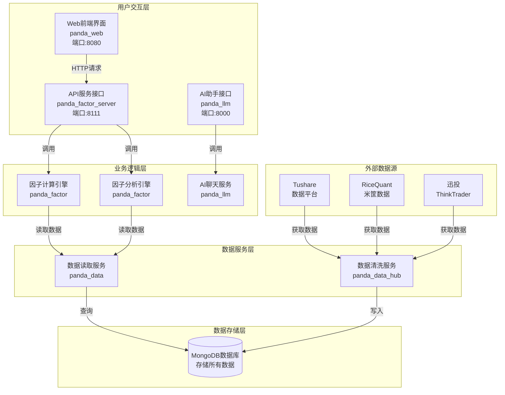
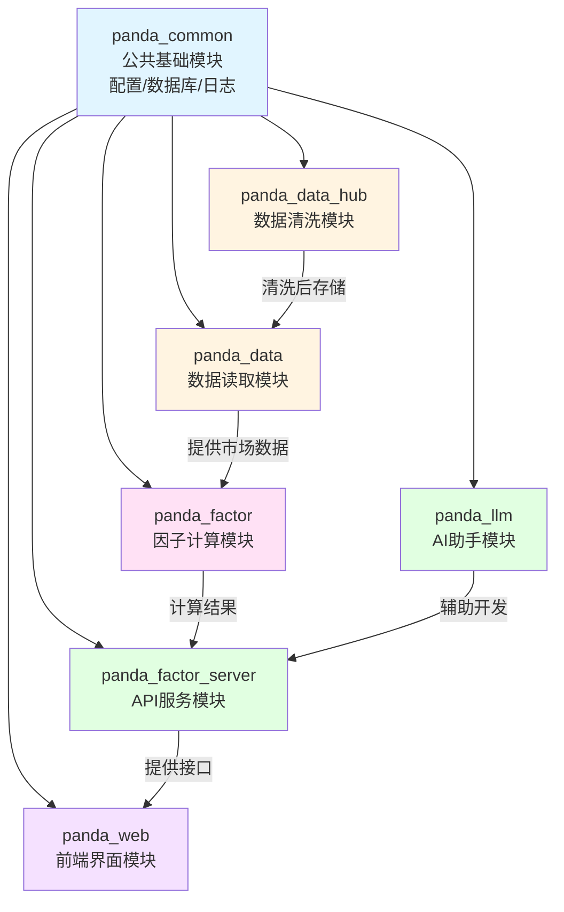
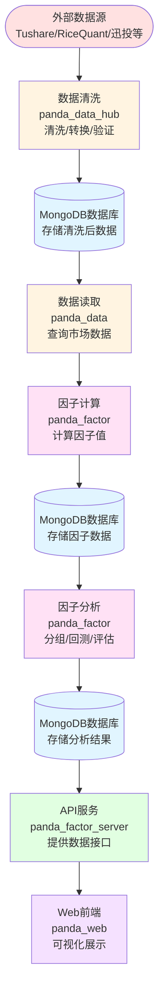
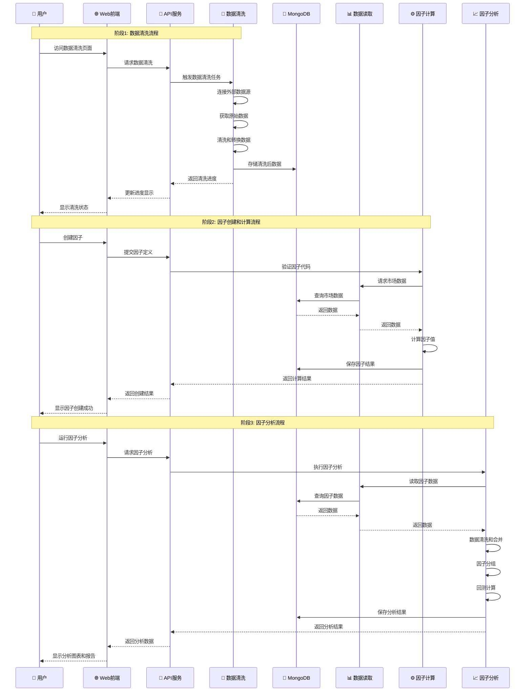

# PandaFactor - PandaAI 量化因子库


## PandaAI 首届因子大赛已启动，你的 Alpha 值得被看见

“没有一个 alpha，一开始就是 alpha”

“开始量化，最好是十年前，其次是现在”

“如果没有天赋，那就一直重复”

“看似不起眼的数学，会在将来的某一天，突然让你看到坚持的意义”

“一切都很好，我听到自己，向上的声音”

“市场会惩罚，模糊的愿望，奖励清晰的请求”

“你正在寻找的因子，此刻也在寻找你”

[点击报名](https://www.pandaai.online/factorhub/factorcompetition)

## 概述

PandaFactor 提供了一系列高性能的量化算子，用于金融数据分析、技术指标计算和因子构建，并且提供了一系列的可视化图表。

## 📚 新手教程

如果你是第一次使用 PandaFactor，强烈建议先阅读我们的[新手教程](./docs/README.md)，那里有详细的入门指南，用最通俗易懂的语言带你从零开始。

## 🏗️ 系统架构

PandaFactor 采用分层架构设计，从用户界面到数据存储，每一层都有明确的职责。下面通过架构图和数据流程图来展示整个系统的设计。

### 整体架构图



### 模块依赖关系图



## 🔄 数据流程

数据在系统中的流转过程，从外部数据源到最终的分析结果展示。

### 完整数据流程图



### 详细数据流序列图

展示用户操作时，系统各模块之间的交互过程：



### 数据流转说明

1. **数据采集阶段**：外部数据源 → 数据清洗 → MongoDB

    - 从 Tushare、RiceQuant、迅投等获取原始数据
    - 清洗、转换、验证数据质量
    - 存储到 MongoDB 数据库

2. **因子计算阶段**：MongoDB → 数据读取 → 因子计算 → MongoDB

    - 从数据库读取市场数据
    - 根据因子定义计算因子值
    - 保存因子结果到数据库

3. **因子分析阶段**：MongoDB → 因子分析 → MongoDB → API → Web
    - 读取因子数据和市场数据
    - 进行分组、回测、评估
    - 保存分析结果
    - 通过 API 提供给前端展示

## 因子编写方法

编写方法主要分为两种方式：

-   Python 方式（适合有一定编程基础的小伙伴）（易维护，推荐）
-   公式方式（适合无编程基础的小伙伴）

### Python 模式

基本语法

```python
class CustomFactor(Factor):
    def calculate(self, factors):
        return result
```

重点要求，必须继承 Factor，必须实现 calculate 方法，calculate 返回值必须是 Series 格式，列为 value，索引列为['symbol','date']构成的多级索引。

factors 包含了基础的量价信息，例如:"close"、"open"、“volume”等，可通过 factors['close']方式获取。

#### 示例

```python
class ComplexFactor(Factor):
    def calculate(self, factors):
        close = factors['close']
        volume = factors['volume']
        high = factors['high']
        low = factors['low']

        # 计算20日收益率
        returns = (close / DELAY(close, 20)) - 1
        # 计算20日波动率
        volatility = STDDEV((close / DELAY(close, 1)) - 1, 20)
        # 计算价格区间
        price_range = (high - low) / close
        # 计算成交量比率
        volume_ratio = volume / DELAY(volume, 1)
        # 计算20日成交量均值
        volume_ma = SUM(volume, 20) / 20
        # 计算动量信号
        momentum = RANK(returns)
        # 计算波动率信号
        vol_signal = IF(volatility > DELAY(volatility, 1), 1, -1)
        # 合成最终因子
        result = momentum * vol_signal * SCALE(volume_ratio / volume_ma)
        return result
```

### 公式方式

基本语法

```python
"函数1(函数2(基础因子), 参数) 运算符 函数3(基础因子)"
```

若是公式比较复杂，可以考虑设置中间变量，分多行编写，系统将读取最后一行作为因子值。

```python
# 计算20日收益率排名
RANK((CLOSE / DELAY(CLOSE, 20)) - 1)

# 计算价格和成交量的相关性
CORRELATION(CLOSE, VOLUME, 20)

# 复杂因子示例
RANK((CLOSE / DELAY(CLOSE, 20)) - 1) *
STDDEV((CLOSE / DELAY(CLOSE, 1)) - 1, 20) *
IF(CLOSE > DELAY(CLOSE, 1), 1, -1)
```

## 函数和算子支持情况

[点击查看](https://www.pandaai.online/community/article/72)

## 安装

-   若您为个人交易者，想要快速本地的使用该因子模块，我们准备了一份初始数据库，解压即可运行，因为文件较大，请联系小助理领取，下载解压后，直接执行 bin/db_start.bat 即可启动数据库。

-   若您为团队或者机构使用者，可以下载系统源码，在本地部署供团队使用。需要提前准备 MongoDB，并且修改 panda_common 的 config.yaml 的文件与其对应。

## 关于数据更新

目前系统内置了近五年的基础数据，供用户使用。后续的数据更新将在每晚 8 点自动清洗执行（需要保证程序在期间正常运行），我们计划对接以下数据源：

| 数据源    | 支持情况 |
| --------- | -------- |
| Tushare   | 已上线   |
| RiceQuant | 已上线   |
| 迅投      | 已上线   |
| Tqsdk     | 测试中   |
| QMT       | 测试中   |
| Wind      | 对接中   |
| Choice    | 对接中   |

若您有相关数据源需求，请务必联系我们，我们会尽快为您接入。

## 下载最新数据库

因表结构更新，请在网盘下载最新的数据库
网盘链接： https://pan.baidu.com/s/1qnUFy7dw6O2yxa_0rE_2MQ?pwd=iayk 提取码: iayk
近期更新因子持久化功能，让计算好的因子直接保存，自动更新，极速提取。

## 📖 快速开始

### 最简单的使用示例

```python
import panda_data

# 初始化数据模块
panda_data.init()

# 获取因子数据
factor = panda_data.get_factor_by_name(
    factor_name="VH03cc651",
    start_date='20240320',
    end_date='20250325'
)
```

### 学习路径

1. **完全新手**：阅读 [新手教程](./docs/README.md)，从零开始学习
2. **有编程基础**：直接查看 [第一个因子](./docs/04-第一个因子.md) 教程
3. **快速上手**：参考上面的代码示例，然后查看 [因子进阶](./docs/05-因子进阶.md)

## 📁 项目结构

```bash
panda_factor/
├── panda_common/       # 公共函数&工具类
│   └── config.yaml     # 配置文件
├── panda_data          # 数据模块，提取数据与因子
├── panda_data_hub/     # 自动更新
│   └── __main__.py     # 自动更新任务启动入口
├── panda_factor        # 因子计算与分析
├── panda_llm           # 大模型接入，支持OpenAI协议，兼容Deepseek
├── panda_factor_server/       # 服务器接口
│   └── __main__.py     # 接口服务启动入口
├── panda_web/          # 服务器前端页面
├── requirements.txt    # 依赖列表
└── README.md           # 项目说明文
```

## 开发者工具指南

### PyCharm 工具

请将 panda_common、panda_data、panda_data_hub、panda_factor、panda_llm、panda_factor_server 这几个文件夹右键标记为 Mark Directiory as Sources root

### Visual Studio Code （包含 Cursor 等衍生）

请在含有 Python 解释器的终端中进入各个子模块目录下面，执行：

```bash
pip install -e .
```

### 如何在自己的系统或策略中引用因子

项目本身只是帮助大家生产和更新因子，避免大家在数据清洗、自动化构建上花太多时间。
可通过以下代码，将生产的因子整合到自己的系统或者策略中：

```python
import panda_data

panda_data.init()
factor = panda_data.get_factor_by_name(
    factor_name="VH03cc651",
    start_date='20240320',
    end_date='20250325'
)
```

## 加群答疑或商务合作


## 数据相关问题答疑


## 贡献

欢迎贡献代码、提出 Issue 或 PR：

Fork 本项目

新建功能分支 git checkout -b feature/AmazingFeature

提交更改 git commit -m 'Add some AmazingFeature'

推送分支 git push origin feature/AmazingFeature

发起 Pull Request

## 致谢

感谢量化李不白的粉丝们对我们的支持

感谢所有开源社区的贡献者

## 许可证

本项目采用 GPLV3 许可证
